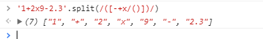
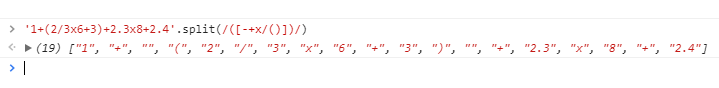
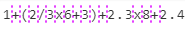
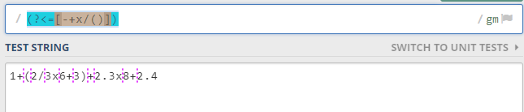
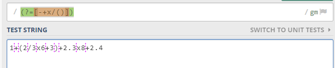

## Vấn đề
Hôm nay mình ngồi làm project Calculator trong FreeCodeCamp cần implement thuật toán tính biểu thức trung vị. Nhưng trước hết có vấn đề nho nhỏ là tách toán tử toán hạng trong chuỗi. Ví dụ như sau:

Chuỗi đầu vào: 1+(2/3x6+3)+2.3x8+2.4

Kết quả đầu ra: ["1", "+", "(", "2", "/", "3", "x", "6", "+", "3", ")", "+", "2.3", "x", "8", "+", "2.4"]

## Giải quyết

Tách từ chuỗi ra mảng nên ta nghĩ tới hàm split. Cái khó ở đây là truyền separator. Ta quen truyền separator đơn giản rồi còn phức tạp như này ta cần đến sức mạnh của RegExp.
Ta có 2 cách: 
Cách 1: 
Separator sẽ là các toán tử. Hàm split sẽ giữ cả các các separator. Ví dụ str.split(/([+-x/()])/). Bạn chú ý cắp dấu ( ) ngay sau / / thể hiện hàm split sẽ giữ các separator thay vì bỏ chúng đi.
Cách này sẽ ổn với các biểu thức ko có ngoặc nhọn. Ví dụ 

Nhưng với biểu thức ban đầu có ngoặc nhọn sẽ bị thừa các kí tự rỗng.

Do găp separator liên tiếp là + và ( nên nó tách kí tự rỗng như trên. 
Công việc sau đó rất đơn giản. Dùng fitler để filter các kí tự rỗng đó đi.

Cách 2: 
Separator chuẩn chỉ hơn sẽ các các đường dứt nét trong hình vẽ

Các đường gạch này trước hoặc sau các toán tử. Do đó hàm split là: str.split(/(?<=[-+x/()])|(?=[-+x/()])/)
Chú ý cặp ngoặc tròn () ở đây không có nghĩa là hàm split sẽ giữ lại separator nữa mà nó là một phần của RegExp
Cụ thể (?<=[-+x/()]) có nghĩa là những chỗ mà các toán tử đứng trước 

Còn (?=[-+x/()]) có nghĩa những chỗ mà toán tử đứng sau

Kết hơp bởi | ta được separator hoàn chỉnh. Và kết quả chuẩn chỉ, ta không cần lọc nữa.

Bạn tham khảo https://docs.microsoft.com/en-us/dotnet/standard/base-types/regular-expression-language-quick-reference để rõ hơn về RegExp.

## Kết luận

2 cách đều không quá dài. Cách thứ nhất dễ nghĩ biểu thức reg hơn. Tuy nhiên lại thêm một bước. Cách thứ 2 khó nghĩ hàm reg hơn.
Sau bước này, bạn có thể áp dụng stack để tính biểu thức nói trên. 

