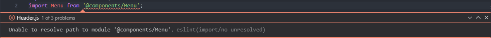
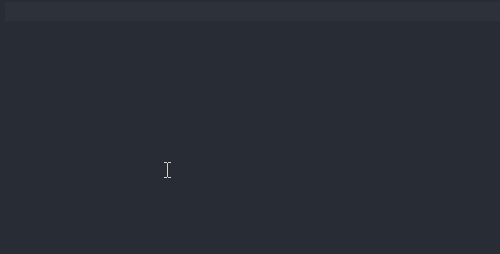

### Alias là gì?
Alias là đường dẫn tuyệt đối thay thế cho đường dẫn tương đối khi import các module. Ví dụ như sau:
```javascript
// thay vì  dùng
import Menu from '../../../components/Form';
// thì dùng
import Menu from '@components/Form';
```
Cách bên dưới chính là sử dụng alias.

### Thế nào là config chuẩn?
Thông thường để config alias trong một project frontend sử dụng webpack. Theo doc chỉ cần config như sau:

**webpack.config.js**
```javascript
module.exports = {
//..
	resolve: {
		alias: {
    		'@components': path.resolve(__dirname, './src/components'),
    	}
	}
}
```
Làm như vậy ta mới giải quyết một vấn đề là cho webpack hiểu được "@components" là gì. Còn 2 vấn đề nữa ta mắc phải đó là:

Eslint không hiểu và báo lỗi.

Texteditor cụ thể là mình đang sử dụng là VSCode không gợi ý.


Vậy config chuẩn alias phải thỏa mãn 3 yếu tố:
1.	Webpack hiểu
2.	Eslint không báo lỗi
3.	VSCode gợi ý được

### Cách thực hiện
#### Webpack hiểu
Ta thực hiện như trên

**webpack.config.js**
```javascript
module.exports = {
//..
	resolve: {
		alias: {
    		'@components': path.resolve(__dirname, './src/components'),
    	}
	}
}
```
#### Eslint không báo lỗi
Ta add thêm thư viện sau đây
```
npm install eslint-plugin-import eslint-import-resolver-alias --save-dev
```
Add đoạn code sau đây

**.eslintrc.js**
```javascript
settings: {
	"import/resolver": {
    	alias: [
        	["@components", "./src/components"],
      	]
    },
 },
```
#### VSCode gợi ý được
Để VSCode hiểu và gợi ý được thì ta add thêm file jsConfig.json ở đầu project như sau.
```json
{
	"compilerOptions": {
    	"baseUrl": "./",
    	"paths": {
      		"@components/*": ["src/components/*"],
    	}
  	},
  	"exclude": ["node_modules"]
}
```
Bạn nhớ để dấu * sau @components nhé.
### Kết luận
Trên đây là cách mình config alias vào project sử dụng webpack của mình. Việc config như vậy sẽ giúp tìm các thành phần dễ hơn, code cũng đẹp hơn và chuyên nghiệp hơn. 

### Tài liệu tham khảo
[1]. [Configuring absolute paths in React for Web without ejecting [en-US]](https://dev.to/heybrunoandrade/configuring-absolute-paths-in-react-for-web-without-ejecting-en-us-52h6)

[2]. [Webpack doc](https://webpack.js.org/configuration/resolve/)
 
[3]. [What is jsConfig?](https://code.visualstudio.com/docs/languages/jsconfig)