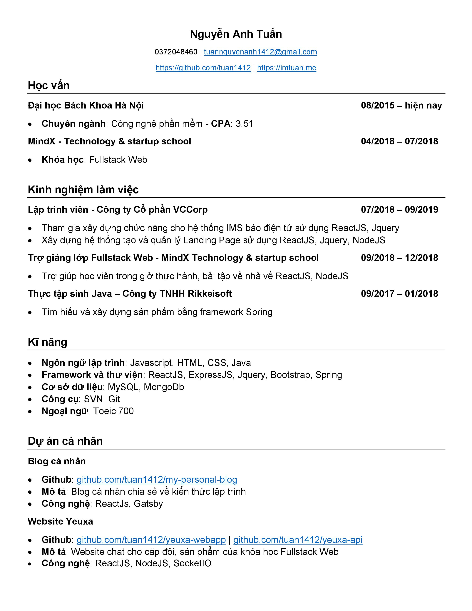

Vậy là mai là ngày bắt đầu đi học của Bách Khoa. Kì học cuối cùng (hi vọng thế) của mình đã đến. Sau đó là sẽ đi xin việc. Hôm nay mình sẽ liệt kê các mục để cải thiện CV hiện giờ của mình.

Đây là CV cũ khi đăng kí làm đồ án tôt nghiệp.

Lượt từ trên xuống dưới, ta thấy các điều cần cải thiện như sau:

1. Phần thông tin cá nhân

   Thiếu Linkedin -> Cần học cách tạo một linkedin chuyên nghiệp thêm vào thông tin cá nhân.

   Blog cá nhân còn ít blog -> Cần viết thêm blog về kĩ thuật hơn.

2. Học vấn

   Chưa tốt nghiệp -> Tốt nghiệp đại học bách khoa, tăng CPA lên 3.6.

3. Kinh nghiệm làm việc

   Phần này có thể thêm thực tập sinh ở VBEE.

   Mô tả rõ hơn (có số liệu) các công việc đã làm.

4. Kĩ năng

   Ngôn ngữ lập trình: Học thêm ngôn ngữ mới (Python) hoặc đào sâu thêm Java.

   Thiếu các framework về backend như ES, Redis, RabbitMQ -> Cần phải học và làm thêm project về cái này.

   Công cụ: Git chưa sử dụng thành thạo lắm. Cần học lại để điền vào tự tin hơn.

   Ngoại ngữ: Tăng toeic lên 850. Ngoài ra còn giao tiếp được.

   Cần thêm các kĩ năng mềm về giao tiếp, hợp tác, làm việc nhóm, quản lý thời gian(Học cách trả lời phỏng vấn ở sách).

   Kĩ năng UI/UX, thuật toán cũng cần phải trau dồi. -> Cần luyện đề thi trên các trang như leetcode, hackerrank

5. Dự án cá nhân

   Project Yeuxa còn quá cùi mía. Cần code lại và áp dụng thêm các cái chưa học.

   Thêm một số dự án nhỏ khác để 6 dự án hiện ở đầu github đều tốt.

Đó là tất cả những điều mình sẽ cải thiện trong năm nay để có một CV đẹp. Năm sau mình sẽ post CV mới ở cuối bài viết này và so sánh xem kết quả
